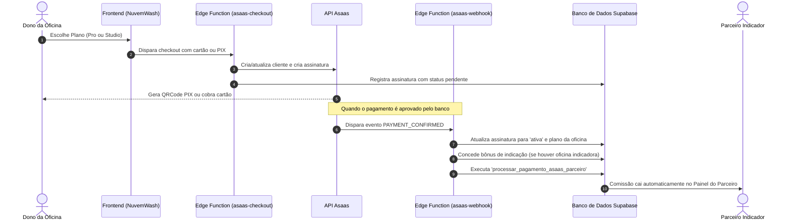

# Guia Completo de Configuração e Integração do Asaas

Este documento contém todas as instruções para ativar e operar os pagamentos de assinatura via **Asaas** na plataforma NuvemWash / Plataforma Detailers.

---

## 1. Secrets Necessárias no Supabase

As Edge Functions do Asaas (`asaas-checkout`, `asaas-webhook`, `asaas-cancelar-assinatura`) executam no ambiente seguro Deno do Supabase. Para que elas consigam autenticar na API do Asaas e no seu banco de dados, configure as seguintes variáveis de ambiente:

Acesse o painel do Supabase:
**Project Settings** ➔ **Edge Functions** ➔ **Secrets** (ou adicione via CLI `supabase secrets set ...`)

| Variável | Descrição | Exemplo |
| :--- | :--- | :--- |
| `ASAAS_API_KEY` | Chave de API gerada no Asaas | `$aact_YTU5YTE0M2M6...` |
| `ASAAS_API_URL` | Endpoint da API do Asaas | `https://api.asaas.com/v3` (Produção) `https://sandbox.asaas.com/v3` (Testes) |
| `ASAAS_WEBHOOK_SECRET` | Token secreto para validar que os webhooks vêm do Asaas | `segredo_webhook_nuvemwash_2026` |
| `SUPABASE_URL` | URL do seu projeto Supabase | `https://xyzcompany.supabase.co` |
| `SUPABASE_SERVICE_ROLE_KEY` | Chave de serviço (`service_role`) para gravação com bypass de RLS | `eyJhbGciOi...` |

> [!IMPORTANT]
> Nunca compartilhe a `ASAAS_API_KEY` nem a `SUPABASE_SERVICE_ROLE_KEY` no código do frontend ou repositório público. Elas devem ficar estritamente nas Secrets do Supabase.

---

## 2. Configuração do Webhook no Painel do Asaas

Para que a ativação de planos e a concessão de comissões de parceiros aconteçam instantaneamente após a confirmação do pagamento (Cartão ou PIX), configure o webhook:

1. Acesse sua conta no **Asaas** (ou Sandbox de testes).
2. Vá em **Minha Conta** / **Configurações da Conta** ➔ **Integrações** ➔ **Webhooks**.
3. Selecione a aba **Cobranças**.
4. Configure os campos:
   - **URL do Webhook:** 
     `https://<SEU-PROJETO>.supabase.co/functions/v1/asaas-webhook`
   - **Versão da API:** `v3`
   - **Email para envio de erros:** seu e-mail de suporte/administrador.
   - **Token de Autenticação:** Digite o mesmo texto que você salvou na secret `ASAAS_WEBHOOK_SECRET` no Supabase. O Asaas enviará esse token no cabeçalho `asaas-access-token` em cada requisição.
5. Em **Eventos**, marque as seguintes opções:
   - `PAYMENT_CONFIRMED` (Pagamento confirmado via Cartão ou PIX)
   - `PAYMENT_RECEIVED` (Pagamento recebido em conta)
   - `PAYMENT_OVERDUE` (Assinatura/fatura vencida sem pagamento)
   - `SUBSCRIPTION_DELETED` (Assinatura cancelada no Asaas)
   - `PAYMENT_REFUNDED` (Pagamento estornado)
6. Clique em **Salvar Configurações**.
7. Clique no botão **Testar Webhook** do Asaas e verifique se o status retornado é `200 OK`.

---

## 3. Fluxo de Vida das Assinaturas e Comissões

---

## 4. O que Acontece Quando a Assinatura é Paga

1. **Ativação da Oficina:** O status da assinatura na tabela `assinaturas` passa para `'ativa'`, e o plano da oficina (`tenants.plano`) é atualizado.
2. **Indicações Entre Oficinas:** Caso a oficina tenha sido indicada por outro cliente através do programa de indicação, os dias de bônus (+15 dias) são computados automaticamente.
3. **Comissão de Parceiro Comercial:** Caso a oficina tenha sido indicada por um **Parceiro Comercial** (link `/parceiro/:codigo`), a função `processar_pagamento_asaas_parceiro` é disparada:
   - Identifica a comissão configurada do parceiro (percentual ou valor fixo).
   - Insere o pagamento da competência em `pagamentos_competencia`.
   - Cria o registro em `parceiro_comissoes` com status `'aprovada'`.
   - O parceiro já vê o valor em seu painel (`/parceiro/painel`) e o Administrador vê em `/admin/parceiros` para realizar o PIX.

---

## 5. Como Testar em Ambiente de Sandbox

1. Crie uma conta de testes em [sandbox.asaas.com](https://sandbox.asaas.com).
2. Gere uma chave de API no menu de integrações do Sandbox.
3. No Supabase, defina `ASAAS_API_URL` como `https://sandbox.asaas.com/v3`.
4. Defina `ASAAS_API_KEY` com a chave gerada no Sandbox.
5. Configure o Webhook do Sandbox apontando para a URL da Edge Function do seu projeto.
6. Realize um pagamento simulado pelo Sandbox e observe o console das Edge Functions no Supabase:
   - `Logs` do `asaas-webhook`: deve registrar `status: success`.
